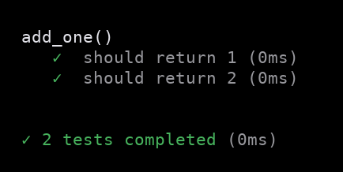

# laboratory
A unit test runner for Rust

## Features
The use of hooks such as before, before_each, after, after_each   
Different reporter options  
Reports test durations  
The use of custom assertion libraries  
Exclude tests  
Nested test suites  
The use of state

## Installation
In Cargo.toml:
```toml
[dev-dependencies]
laboratory = "*"
```
Then in your test files
```rust
#[cfg(test)]
mod tests {
    use laboratory::{describe, describe_skip, it, it_skip, it_only, expect};
}
```

## Getting Started
### Testing a simple function "add_one"
```rust

fn add_one (x: u64) -> u64 { x + 1 }

#[cfg(test)]
mod tests {

    use super::*;
    use laboratory::{describe, it, expect};

    #[test]
    fn suite() {


    describe("add_one()")
        .specs(vec![

            it("should return 1", || {
                expect(add_one(0)).to_equal(1)?;
                Ok(())
            }),

            it("should return 2", || {
                expect(add_one(1)).to_equal(2)?;
                Ok(())
            })

        ]).run();


    }
}

```

Then run: 
```shell script
$ cargo test -- --nocapture
```

Result:
